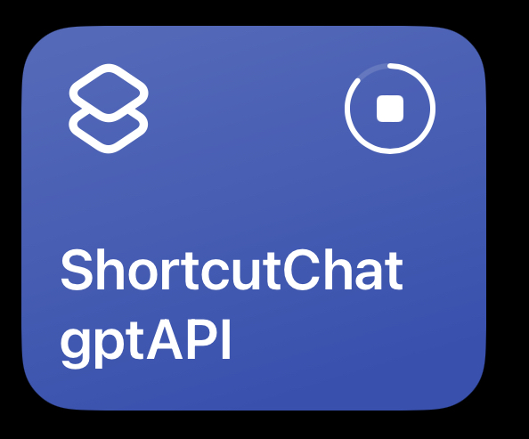

# shortcut_chatgpt_api

This repo intition is to connecting the shortcut services as an api to other devices, using ChatGPT app as an example. The following diagram show that the communication between my laptop and IOS/iPadOS devices. On my laptop, it running two http services. One is the endpoint used to receive a query, and the perpose of the theother one is to communitation with IOS/iPadOS devices. Since the IOS/iPadOS devices connot provide an API service, we make apple devices query question every 1 second and post the answer when the computation is done. This allows the convenience of apple shortcut can extend to other devices.


If you want to use the following example of implement ChatGPT app, modify the variable in the following image.


[Download](https://www.icloud.com/shortcuts/9e17a4606a404cad895394dfb10ebc4d)

## Run

step1: run main service
```bash
python3 main.py
```

step2: start shortcut

Run `ShortcutChatgptAPI` shortcut app. This will run in an infinite loop, but might be killed by iOS/iPadOS when run in background.



step3: try to call the service
```bash
$ curl  -H "Content-Type: application/json" -X POST http://localhost:9001/question \
  -d '{"question": "What is GitHub? (reply in 1 sentence)"}'
  
# {"answer": "GitHub is a web-based platform for version control and collaboration that allows developers to host, manage, and share their code repositories.", "success": true}
```

```python
import requests
url = 'http://localhost:9001/question'
def ask(text):
    x = requests.post(url, json = dict(question=text))
    return x.json()

response = ask("What is GitHub? (reply in 1 sentence)")
print('success:', response['success'])
# success: True
print('answer:', response['answer'])
# answer: GitHub is a web-based platform for version control and collaboration that allows developers to store, manage, and share their code repositories.
```

Done!!

## Disclaimers
This repository is not reverse engineering and is only for experimental purposes only. The intention behind this is to integrate shortcut and host, with no malicious intent or commercial use. The app we use is for experimental purposes. Users should use the official tool/API to do further usage in their work. The repository owner and contributors shall not be held liable for any misuse or misinterpretation of the information presented here. 

