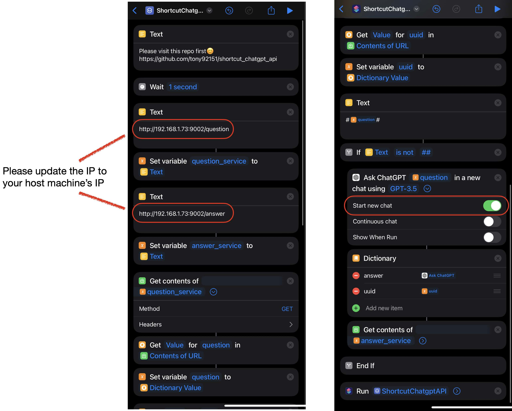

# shortcut_chatgpt_api




[Download](https://www.icloud.com/shortcuts/9e17a4606a404cad895394dfb10ebc4d)

## Run

```bash
python3 main.py
```

## Example
```bash
$ curl  -H "Content-Type: application/json" -X POST http://localhost:9001/question \
  -d '{"question": "What is GitHub? (reply in 1 sentence)"}'
  
# {"answer": "GitHub is a web-based platform for version control and collaboration that allows developers to host, manage, and share their code repositories.", "success": true}
```

```python
import requests
url = 'http://localhost:9001/question'
def ask(text):
    x = requests.post(url, json = dict(question=text))
    return x.json()

response = ask("What is GitHub? (reply in 1 sentence)")
print('success:', response['success'])
# success: True
print('answer:', response['answer'])
# answer: GitHub is a web-based platform for version control and collaboration that allows developers to store, manage, and share their code repositories.
```
## Disclaimers
This repository contains software that has been subjected to reverse engineering for experimental purposes only. The intention behind this research is to gain insights into the software's inner workings, with no malicious intent or commercial use. Users should use the official API to do further usage in their work. The repository owner and contributors shall not be held liable for any misuse or misinterpretation of the information presented here. 

