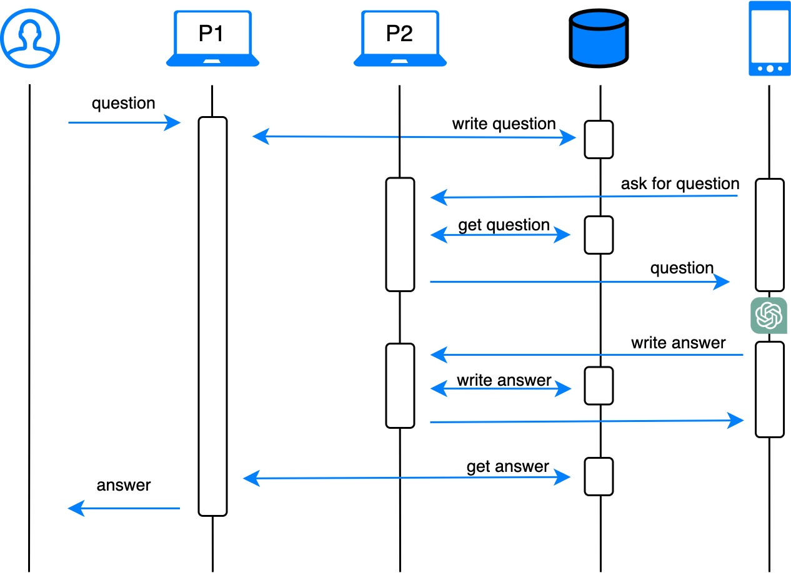

# shortcut_chatgpt_api



## Run

```bash
python3 main.py
```

## Example
```bash
$ curl  -H "Content-Type: application/json" -X POST http://localhost:9001/question \
  -d '{"question": "What is GitHub? (reply in 1 sentence)"}'
  
# {"answer": "GitHub is a web-based platform for version control and collaboration that allows developers to host, manage, and share their code repositories.", "success": true}
```

```python
import requests
url = 'http://localhost:9001/question'
def ask(text):
    x = requests.post(url, json = dict(question=text))
    return x.json()

response = ask("What is GitHub? (reply in 1 sentence)")
print('success:', response['success'])
# success: True
print('answer:', response['answer'])
# answer: GitHub is a web-based platform for version control and collaboration that allows developers to store, manage, and share their code repositories.
```

